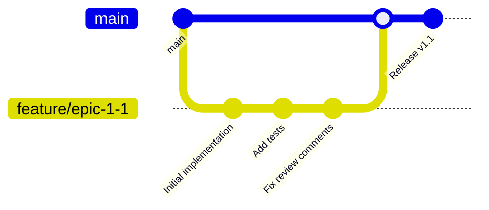

# Development Methodology for ERP System Microservices Modernization

## Overview

This document defines the development methodology and production-readiness standards for the ERP System microservices modernization project. It establishes comprehensive gates and criteria that must be met before any code can be merged to the main branch and deployed to production.

## Table of Contents

1. [Development Workflow](#development-workflow)
2. [Production-Readiness Gates](#production-readiness-gates)
3. [Code Quality Standards](#code-quality-standards)
4. [Testing Requirements](#testing-requirements)
5. [Security Standards](#security-standards)
6. [Performance Requirements](#performance-requirements)
7. [Documentation Standards](#documentation-standards)
8. [Deployment Readiness](#deployment-readiness)
9. [Monitoring and Observability](#monitoring-and-observability)
10. [Compliance and Audit](#compliance-and-audit)

## Development Workflow

### Branch Strategy



**Branch Naming Convention:**
- Feature branches: `feature/epic-{phase}-{epic-number}` (e.g., `feature/epic-1-1`)
- Hotfix branches: `hotfix/issue-{number}`
- Release branches: `release/v{major}.{minor}.{patch}`

### Pull Request Process

1. **Create Feature Branch** from latest `main`
2. **Implement Changes** following coding standards
3. **Run Local Validation** (tests, linting, security scans)
4. **Create Pull Request** with comprehensive description
5. **Automated Validation** (CI/CD pipeline execution)
6. **Code Review** (minimum 2 approvals required)
7. **Production-Readiness Verification** (all gates passed)
8. **Merge to Main** (squash and merge strategy)

## Production-Readiness Gates

### Gate 1: Code Quality ✅

**Automated Checks:**
- [ ] **Static Code Analysis**: SonarQube quality gate passed
- [ ] **Code Coverage**: Minimum 80% line coverage, 70% branch coverage
- [ ] **Linting**: Checkstyle violations = 0
- [ ] **Dependency Vulnerabilities**: No high/critical security vulnerabilities
- [ ] **Code Duplication**: < 3% duplicated lines

**Manual Review:**
- [ ] **Architecture Compliance**: Follows microservices design patterns
- [ ] **SOLID Principles**: Code adheres to SOLID design principles
- [ ] **Domain-Driven Design**: Proper bounded context implementation
- [ ] **Error Handling**: Comprehensive exception handling and logging

### Gate 2: Testing Excellence ✅

**Unit Testing:**
- [ ] **Coverage**: ≥80% line coverage, ≥70% branch coverage
- [ ] **Test Quality**: Meaningful assertions, proper mocking
- [ ] **Fast Execution**: Unit tests complete in <30 seconds
- [ ] **Isolation**: Tests are independent and can run in any order

**Integration Testing:**
- [ ] **API Testing**: All REST endpoints tested with realistic scenarios
- [ ] **Database Integration**: Repository layer fully tested
- [ ] **External Service Integration**: Mock external dependencies
- [ ] **Error Scenarios**: Negative test cases for failure conditions

**End-to-End Testing:**
- [ ] **Critical User Journeys**: Key business workflows validated
- [ ] **Cross-Service Communication**: Service-to-service interactions tested
- [ ] **Data Consistency**: Eventual consistency scenarios verified
- [ ] **Performance Baseline**: Response times within acceptable limits

### Gate 3: Security Compliance ✅

**Security Scanning:**
- [ ] **SAST**: Static Application Security Testing passed
- [ ] **Dependency Check**: No known vulnerabilities in dependencies
- [ ] **Container Security**: Docker images scanned for vulnerabilities
- [ ] **Secrets Management**: No hardcoded secrets or credentials

**Security Implementation:**
- [ ] **Authentication**: Proper JWT token validation
- [ ] **Authorization**: Role-based access control implemented
- [ ] **Input Validation**: All inputs sanitized and validated
- [ ] **Audit Logging**: Security events properly logged
- [ ] **HTTPS/TLS**: All communications encrypted

### Gate 4: Performance Standards ✅

**Performance Testing:**
- [ ] **Load Testing**: Handles expected concurrent users
- [ ] **Stress Testing**: Graceful degradation under high load
- [ ] **Endurance Testing**: No memory leaks over extended periods
- [ ] **Spike Testing**: Handles sudden traffic increases

**Performance Metrics:**
- [ ] **Response Time**: 95th percentile < 500ms for API calls
- [ ] **Throughput**: Minimum 1000 requests/second per service
- [ ] **Resource Usage**: CPU < 70%, Memory < 80% under normal load
- [ ] **Database Performance**: Query execution time < 100ms

### Gate 5: Operational Readiness ✅

**Monitoring and Observability:**
- [ ] **Health Checks**: Liveness and readiness probes implemented
- [ ] **Metrics**: Business and technical metrics exposed
- [ ] **Logging**: Structured logging with correlation IDs
- [ ] **Distributed Tracing**: Request tracing across services
- [ ] **Alerting**: Critical alerts configured

**Deployment Readiness:**
- [ ] **Container Images**: Multi-stage Docker builds optimized
- [ ] **Configuration Management**: Externalized configuration
- [ ] **Database Migrations**: Liquibase migrations tested
- [ ] **Rollback Strategy**: Automated rollback procedures defined
- [ ] **Blue-Green Deployment**: Zero-downtime deployment capability

## Code Quality Standards

### Java/Spring Boot Standards

```java
// Example: Proper service implementation
@Service
@Transactional
@Slf4j
public class AssetManagementService {
    
    private final AssetRepository assetRepository;
    private final AssetEventPublisher eventPublisher;
    
    public AssetManagementService(AssetRepository assetRepository, 
                                 AssetEventPublisher eventPublisher) {
        this.assetRepository = assetRepository;
        this.eventPublisher = eventPublisher;
    }
    
    @Retryable(value = {DataAccessException.class}, maxAttempts = 3)
    public AssetDTO createAsset(CreateAssetRequest request) {
        log.info("Creating asset with registration number: {}", 
                request.getRegistrationNumber());
        
        try {
            Asset asset = Asset.builder()
                .registrationNumber(request.getRegistrationNumber())
                .description(request.getDescription())
                .cost(request.getCost())
                .build();
                
            Asset savedAsset = assetRepository.save(asset);
            eventPublisher.publishAssetCreated(savedAsset);
            
            log.info("Successfully created asset with ID: {}", savedAsset.getId());
            return AssetMapper.toDTO(savedAsset);
            
        } catch (DataIntegrityViolationException e) {
            log.error("Asset creation failed due to data integrity violation", e);
            throw new AssetCreationException("Asset with registration number already exists");
        }
    }
}
```

**Coding Standards:**
- **Naming**: Clear, descriptive names for classes, methods, and variables
- **Method Size**: Maximum 20 lines per method
- **Class Size**: Maximum 200 lines per class
- **Complexity**: Cyclomatic complexity < 10
- **Comments**: Javadoc for public APIs, inline comments for complex logic

### Angular/TypeScript Standards

```typescript
// Example: Proper component implementation
@Component({
  selector: 'app-asset-list',
  templateUrl: './asset-list.component.html',
  styleUrls: ['./asset-list.component.scss'],
  changeDetection: ChangeDetectionStrategy.OnPush
})
export class AssetListComponent implements OnInit, OnDestroy {
  
  assets$ = this.assetService.getAssets().pipe(
    catchError(error => {
      this.notificationService.showError('Failed to load assets');
      return of([]);
    })
  );
  
  private destroy$ = new Subject<void>();
  
  constructor(
    private assetService: AssetService,
    private notificationService: NotificationService,
    private cdr: ChangeDetectorRef
  ) {}
  
  ngOnInit(): void {
    this.loadAssets();
  }
  
  ngOnDestroy(): void {
    this.destroy$.next();
    this.destroy$.complete();
  }
  
  private loadAssets(): void {
    this.assetService.getAssets()
      .pipe(takeUntil(this.destroy$))
      .subscribe({
        next: assets => this.cdr.markForCheck(),
        error: error => this.handleError(error)
      });
  }
}
```

## Testing Requirements

### Unit Testing Standards

**Test Structure (AAA Pattern):**
```java
@ExtendWith(MockitoExtension.class)
class AssetManagementServiceTest {
    
    @Mock
    private AssetRepository assetRepository;
    
    @Mock
    private AssetEventPublisher eventPublisher;
    
    @InjectMocks
    private AssetManagementService assetService;
    
    @Test
    @DisplayName("Should create asset successfully when valid request provided")
    void shouldCreateAssetSuccessfully() {
        // Arrange
        CreateAssetRequest request = CreateAssetRequest.builder()
            .registrationNumber("AST-001")
            .description("Test Asset")
            .cost(BigDecimal.valueOf(10000))
            .build();
            
        Asset expectedAsset = Asset.builder()
            .id(1L)
            .registrationNumber("AST-001")
            .description("Test Asset")
            .cost(BigDecimal.valueOf(10000))
            .build();
            
        when(assetRepository.save(any(Asset.class))).thenReturn(expectedAsset);
        
        // Act
        AssetDTO result = assetService.createAsset(request);
        
        // Assert
        assertThat(result).isNotNull();
        assertThat(result.getRegistrationNumber()).isEqualTo("AST-001");
        assertThat(result.getDescription()).isEqualTo("Test Asset");
        assertThat(result.getCost()).isEqualTo(BigDecimal.valueOf(10000));
        
        verify(assetRepository).save(any(Asset.class));
        verify(eventPublisher).publishAssetCreated(expectedAsset);
    }
}
```

### Integration Testing Standards

**API Integration Tests:**
```java
@SpringBootTest(webEnvironment = SpringBootTest.WebEnvironment.RANDOM_PORT)
@AutoConfigureTestDatabase(replace = AutoConfigureTestDatabase.Replace.NONE)
@Testcontainers
class AssetManagementResourceIT {
    
    @Container
    static PostgreSQLContainer<?> postgres = new PostgreSQLContainer<>("postgres:13")
            .withDatabaseName("erp_test")
            .withUsername("test")
            .withPassword("test");
    
    @Autowired
    private TestRestTemplate restTemplate;
    
    @Autowired
    private AssetRepository assetRepository;
    
    @Test
    void shouldCreateAssetViaAPI() {
        // Arrange
        CreateAssetRequest request = new CreateAssetRequest();
        request.setRegistrationNumber("AST-API-001");
        request.setDescription("API Test Asset");
        request.setCost(BigDecimal.valueOf(15000));
        
        HttpEntity<CreateAssetRequest> entity = new HttpEntity<>(request);
        
        // Act
        ResponseEntity<AssetDTO> response = restTemplate.postForEntity(
            "/api/assets", entity, AssetDTO.class);
        
        // Assert
        assertThat(response.getStatusCode()).isEqualTo(HttpStatus.CREATED);
        assertThat(response.getBody()).isNotNull();
        assertThat(response.getBody().getRegistrationNumber()).isEqualTo("AST-API-001");
        
        // Verify database state
        Optional<Asset> savedAsset = assetRepository.findByRegistrationNumber("AST-API-001");
        assertThat(savedAsset).isPresent();
    }
}
```

## Security Standards

### Authentication and Authorization

**JWT Token Validation:**
```java
@Component
public class JwtAuthenticationFilter extends OncePerRequestFilter {
    
    @Override
    protected void doFilterInternal(HttpServletRequest request, 
                                  HttpServletResponse response, 
                                  FilterChain filterChain) throws ServletException, IOException {
        
        String token = extractToken(request);
        
        if (token != null && jwtTokenProvider.validateToken(token)) {
            Authentication auth = jwtTokenProvider.getAuthentication(token);
            SecurityContextHolder.getContext().setAuthentication(auth);
        }
        
        filterChain.doFilter(request, response);
    }
}
```

**Role-Based Access Control:**
```java
@RestController
@RequestMapping("/api/assets")
@PreAuthorize("hasRole('ASSET_MANAGER')")
public class AssetManagementResource {
    
    @PostMapping
    @PreAuthorize("hasAuthority('ASSET_CREATE')")
    public ResponseEntity<AssetDTO> createAsset(@Valid @RequestBody CreateAssetRequest request) {
        // Implementation
    }
    
    @DeleteMapping("/{id}")
    @PreAuthorize("hasAuthority('ASSET_DELETE') and @assetSecurityService.canDelete(#id)")
    public ResponseEntity<Void> deleteAsset(@PathVariable Long id) {
        // Implementation
    }
}
```

### Input Validation

```java
public class CreateAssetRequest {
    
    @NotBlank(message = "Registration number is required")
    @Pattern(regexp = "^[A-Z]{3}-\\d{3}$", message = "Invalid registration number format")
    private String registrationNumber;
    
    @NotBlank(message = "Description is required")
    @Size(max = 255, message = "Description must not exceed 255 characters")
    private String description;
    
    @NotNull(message = "Cost is required")
    @DecimalMin(value = "0.01", message = "Cost must be greater than zero")
    @Digits(integer = 12, fraction = 2, message = "Invalid cost format")
    private BigDecimal cost;
}
```

## Performance Requirements

### Response Time Standards

| Operation Type | Target Response Time | Maximum Response Time |
|---------------|---------------------|----------------------|
| Simple Queries | < 100ms | < 200ms |
| Complex Queries | < 500ms | < 1000ms |
| Create Operations | < 200ms | < 500ms |
| Update Operations | < 200ms | < 500ms |
| Delete Operations | < 100ms | < 300ms |
| Batch Operations | < 2000ms | < 5000ms |

### Caching Strategy

```java
@Service
@CacheConfig(cacheNames = "assets")
public class AssetQueryService {
    
    @Cacheable(key = "#id")
    public AssetDTO findById(Long id) {
        // Implementation
    }
    
    @Cacheable(key = "#registrationNumber")
    public AssetDTO findByRegistrationNumber(String registrationNumber) {
        // Implementation
    }
    
    @CacheEvict(key = "#asset.id")
    public void evictAssetCache(Asset asset) {
        // Cache eviction logic
    }
}
```

## Documentation Standards

### API Documentation

**OpenAPI/Swagger Annotations:**
```java
@RestController
@RequestMapping("/api/assets")
@Tag(name = "Asset Management", description = "Operations for managing fixed assets")
public class AssetManagementResource {
    
    @PostMapping
    @Operation(summary = "Create a new asset", description = "Creates a new fixed asset in the system")
    @ApiResponses(value = {
        @ApiResponse(responseCode = "201", description = "Asset created successfully",
                    content = @Content(schema = @Schema(implementation = AssetDTO.class))),
        @ApiResponse(responseCode = "400", description = "Invalid request data",
                    content = @Content(schema = @Schema(implementation = ErrorResponse.class))),
        @ApiResponse(responseCode = "409", description = "Asset already exists",
                    content = @Content(schema = @Schema(implementation = ErrorResponse.class)))
    })
    public ResponseEntity<AssetDTO> createAsset(
            @Parameter(description = "Asset creation request", required = true)
            @Valid @RequestBody CreateAssetRequest request) {
        // Implementation
    }
}
```

### Architecture Decision Records (ADRs)

**Template for ADRs:**
```markdown
# ADR-001: Use Event-Driven Architecture for Cross-Service Communication

## Status
Accepted

## Context
We need to enable loose coupling between microservices while maintaining data consistency.

## Decision
We will use an event-driven architecture with Apache Kafka as the message broker.

## Consequences
- **Positive**: Loose coupling, scalability, fault tolerance
- **Negative**: Increased complexity, eventual consistency challenges
```

## Deployment Readiness

### Container Standards

**Multi-stage Dockerfile:**
```dockerfile
# Build stage
FROM maven:3.8.4-openjdk-17 AS build
WORKDIR /app
COPY pom.xml .
RUN mvn dependency:go-offline
COPY src ./src
RUN mvn clean package -DskipTests

# Runtime stage
FROM openjdk:17-jre-slim
WORKDIR /app
COPY --from=build /app/target/erp-asset-service.jar app.jar
EXPOSE 8080
HEALTHCHECK --interval=30s --timeout=3s --start-period=5s --retries=3 \
  CMD curl -f http://localhost:8080/actuator/health || exit 1
ENTRYPOINT ["java", "-jar", "app.jar"]
```

### Kubernetes Deployment

**Deployment Manifest:**
```yaml
apiVersion: apps/v1
kind: Deployment
metadata:
  name: asset-service
  labels:
    app: asset-service
    version: v1.0.0
spec:
  replicas: 3
  selector:
    matchLabels:
      app: asset-service
  template:
    metadata:
      labels:
        app: asset-service
        version: v1.0.0
    spec:
      containers:
      - name: asset-service
        image: erp/asset-service:v1.0.0
        ports:
        - containerPort: 8080
        env:
        - name: SPRING_PROFILES_ACTIVE
          value: "production"
        - name: DATABASE_URL
          valueFrom:
            secretKeyRef:
              name: database-secret
              key: url
        livenessProbe:
          httpGet:
            path: /actuator/health/liveness
            port: 8080
          initialDelaySeconds: 30
          periodSeconds: 10
        readinessProbe:
          httpGet:
            path: /actuator/health/readiness
            port: 8080
          initialDelaySeconds: 5
          periodSeconds: 5
        resources:
          requests:
            memory: "512Mi"
            cpu: "250m"
          limits:
            memory: "1Gi"
            cpu: "500m"
```

## Monitoring and Observability

### Metrics Collection

**Custom Metrics:**
```java
@Component
public class AssetMetrics {
    
    private final Counter assetCreationCounter;
    private final Timer assetCreationTimer;
    private final Gauge activeAssetsGauge;
    
    public AssetMetrics(MeterRegistry meterRegistry) {
        this.assetCreationCounter = Counter.builder("assets.created.total")
            .description("Total number of assets created")
            .register(meterRegistry);
            
        this.assetCreationTimer = Timer.builder("assets.creation.duration")
            .description("Time taken to create an asset")
            .register(meterRegistry);
            
        this.activeAssetsGauge = Gauge.builder("assets.active.count")
            .description("Number of active assets")
            .register(meterRegistry, this, AssetMetrics::getActiveAssetCount);
    }
    
    public void recordAssetCreation() {
        assetCreationCounter.increment();
    }
    
    public Timer.Sample startAssetCreationTimer() {
        return Timer.start(assetCreationTimer);
    }
}
```

### Logging Standards

**Structured Logging:**
```java
@Slf4j
@Service
public class AssetManagementService {
    
    public AssetDTO createAsset(CreateAssetRequest request) {
        MDC.put("operation", "createAsset");
        MDC.put("registrationNumber", request.getRegistrationNumber());
        
        try {
            log.info("Starting asset creation process");
            
            Asset asset = createAssetEntity(request);
            Asset savedAsset = assetRepository.save(asset);
            
            log.info("Asset created successfully with ID: {}", savedAsset.getId());
            
            return AssetMapper.toDTO(savedAsset);
            
        } catch (Exception e) {
            log.error("Asset creation failed", e);
            throw new AssetCreationException("Failed to create asset", e);
        } finally {
            MDC.clear();
        }
    }
}
```

## Compliance and Audit

### Audit Trail Requirements

**Audit Event Logging:**
```java
@EventListener
@Async
public void handleAssetCreatedEvent(AssetCreatedEvent event) {
    AuditEntry auditEntry = AuditEntry.builder()
        .entityType("Asset")
        .entityId(event.getAssetId())
        .action("CREATE")
        .userId(event.getUserId())
        .timestamp(Instant.now())
        .details(event.getDetails())
        .build();
        
    auditService.recordAuditEntry(auditEntry);
}
```

### Data Privacy Compliance

**GDPR Compliance:**
- [ ] **Data Minimization**: Only collect necessary data
- [ ] **Purpose Limitation**: Use data only for stated purposes
- [ ] **Data Retention**: Implement data retention policies
- [ ] **Right to Erasure**: Support data deletion requests
- [ ] **Data Portability**: Enable data export functionality

## Checklist for Production Readiness

### Pre-Merge Checklist

**Developer Checklist:**
- [ ] All unit tests pass locally
- [ ] Integration tests pass locally
- [ ] Code coverage meets minimum requirements
- [ ] Static analysis passes (SonarQube)
- [ ] Security scan passes
- [ ] Performance tests pass
- [ ] Documentation updated
- [ ] API documentation generated
- [ ] Database migrations tested
- [ ] Configuration externalized

**CI/CD Pipeline Checklist:**
- [ ] Build succeeds
- [ ] All tests pass
- [ ] Code quality gates pass
- [ ] Security scans pass
- [ ] Container image builds successfully
- [ ] Deployment to staging succeeds
- [ ] Smoke tests pass in staging
- [ ] Performance benchmarks meet requirements

**Code Review Checklist:**
- [ ] Code follows established patterns
- [ ] Error handling is comprehensive
- [ ] Security best practices followed
- [ ] Performance considerations addressed
- [ ] Logging and monitoring implemented
- [ ] Documentation is complete and accurate

### Post-Deployment Checklist

**Operational Verification:**
- [ ] Health checks responding correctly
- [ ] Metrics being collected
- [ ] Logs being generated properly
- [ ] Alerts configured and tested
- [ ] Database connections healthy
- [ ] External service integrations working
- [ ] Performance within acceptable limits
- [ ] Security controls functioning

## Continuous Improvement

### Metrics and KPIs

**Development Metrics:**
- Lead Time: Time from commit to production
- Deployment Frequency: How often we deploy
- Mean Time to Recovery: Time to recover from failures
- Change Failure Rate: Percentage of deployments causing failures

**Quality Metrics:**
- Code Coverage: Percentage of code covered by tests
- Technical Debt: SonarQube technical debt ratio
- Bug Escape Rate: Bugs found in production vs. testing
- Customer Satisfaction: User feedback and ratings

### Regular Reviews

**Weekly:**
- Code quality metrics review
- Test coverage analysis
- Performance metrics review
- Security vulnerability assessment

**Monthly:**
- Architecture decision review
- Process improvement retrospective
- Tool and technology evaluation
- Team skill development planning

**Quarterly:**
- Methodology effectiveness review
- Industry best practices assessment
- Technology stack evaluation
- Long-term roadmap alignment

---

## Conclusion

This development methodology ensures that all components of the ERP System microservices modernization project meet production-ready standards before merge. By following these guidelines, we maintain high quality, security, performance, and reliability standards throughout the development lifecycle.

The methodology is designed to be:
- **Comprehensive**: Covers all aspects of software development
- **Practical**: Based on current industry best practices
- **Measurable**: Includes specific metrics and criteria
- **Adaptable**: Can evolve with changing requirements and technologies

Regular review and continuous improvement of this methodology will ensure it remains effective and relevant as the project progresses.
