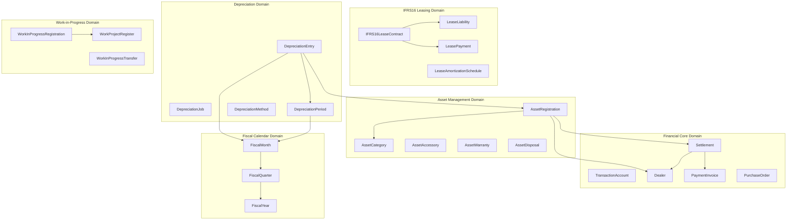
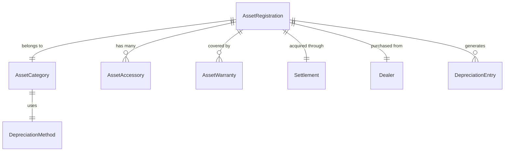
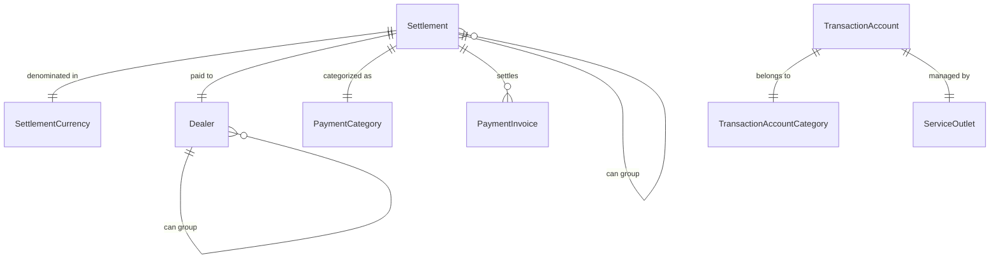
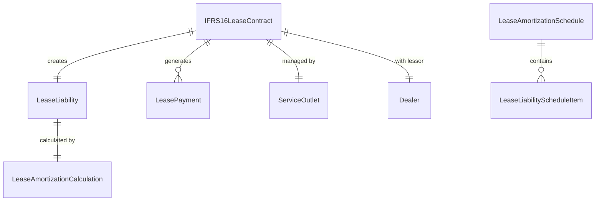
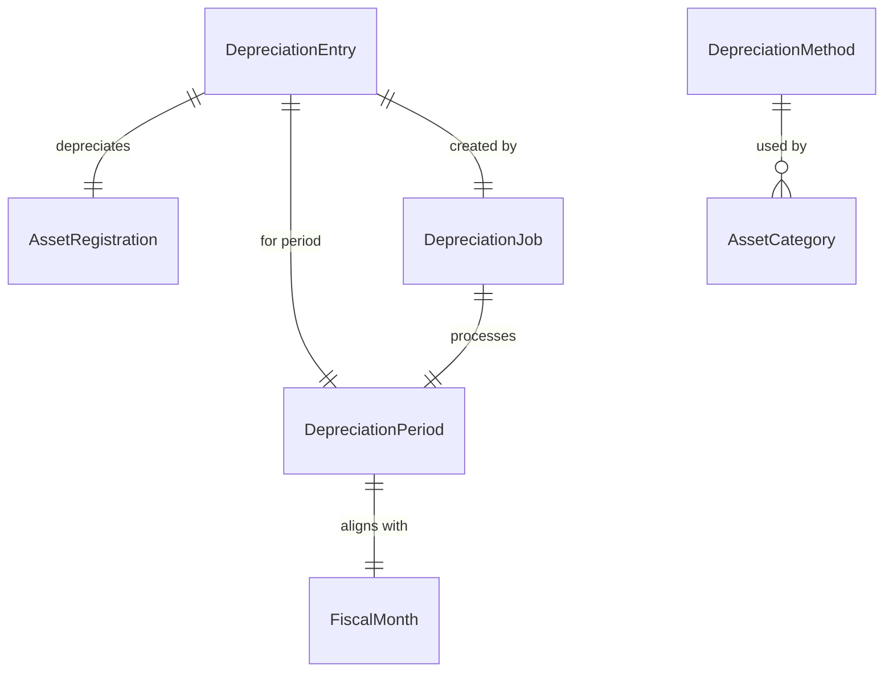
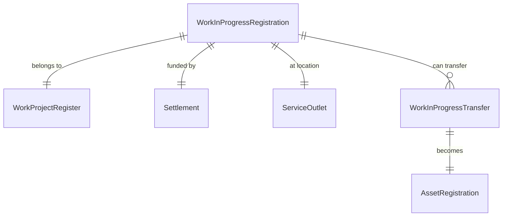
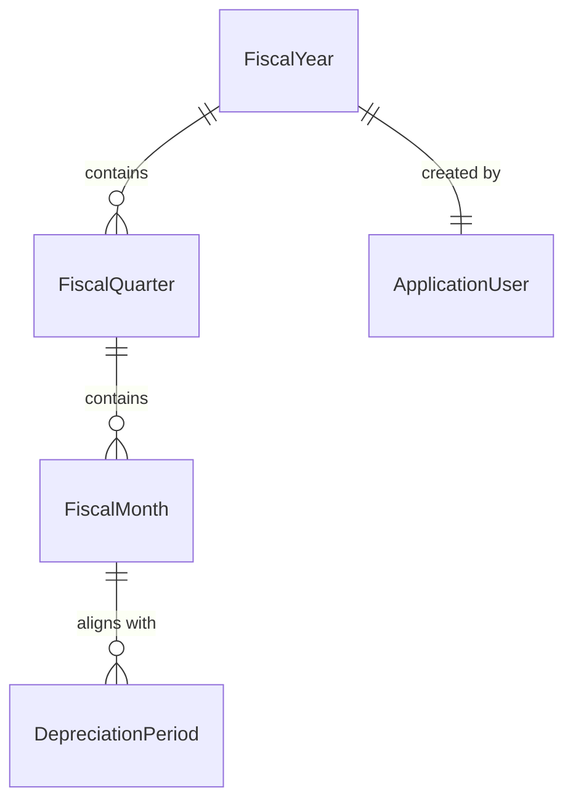

# ERP System Domain Entities Documentation

## Overview

The **ERP System - Mark X No 10 (Jehoiada Series) Server ver 1.8.2** is a comprehensive Enterprise Resource Planning system built on Spring Boot and JHipster. This document provides a complete analysis of the domain model, covering **300+ domain entities** organized across **6 major business domains**.

## Business Domain Architecture

## Core Domain Entities by Business Area

### 1. Asset Management Domain

The Asset Management domain handles the complete lifecycle of fixed assets from registration to disposal.

#### Core Entities:
- **AssetRegistration**: Central asset entity with cost, capitalization date, and lifecycle tracking
- **AssetCategory**: Classification with depreciation methods and rates
- **AssetAccessory**: Additional components and accessories for assets
- **AssetWarranty**: Warranty information and coverage details
- **AssetDisposal**: Asset disposal tracking and financial impact
- **AssetRevaluation**: Asset revaluation records and adjustments

#### Key Relationships:

### 2. Financial Core Domain

The Financial Core domain manages all financial transactions, settlements, and accounting operations.

#### Core Entities:
- **TransactionAccount**: Chart of accounts with account types and categories
- **Settlement**: Payment transactions with amounts, dates, and supporting documents
- **Dealer**: Vendors, suppliers, and business partners with banking details
- **PaymentInvoice**: Invoice management and payment processing
- **PurchaseOrder**: Purchase order lifecycle and approvals
- **PaymentCategory**: Classification of payment types
- **SettlementCurrency**: Multi-currency support

#### Key Relationships:

### 3. IFRS16 Leasing Domain

Handles lease accounting compliance with International Financial Reporting Standard 16.

#### Core Entities:
- **IFRS16LeaseContract**: Lease agreements with terms and conditions
- **LeaseLiability**: Financial obligations from lease agreements
- **LeasePayment**: Individual lease payment records
- **LeaseAmortizationSchedule**: Systematic lease liability reduction
- **LeaseAmortizationCalculation**: Calculation engine for lease accounting
- **RouDepreciationEntry**: Right-of-Use asset depreciation

#### Key Relationships:

### 4. Depreciation Processing Domain

Manages automated depreciation calculations and batch processing.

#### Core Entities:
- **DepreciationEntry**: Individual depreciation calculations
- **DepreciationJob**: Batch depreciation processing jobs
- **DepreciationPeriod**: Time periods for depreciation calculations
- **DepreciationMethod**: Calculation methods (straight-line, reducing balance)
- **DepreciationBatchSequence**: Batch processing orchestration
- **NetBookValueEntry**: Asset net book value tracking

#### Key Relationships:

### 5. Work-in-Progress Domain

Tracks project work and capital expenditure in progress.

#### Core Entities:
- **WorkInProgressRegistration**: Individual WIP items with costs and completion
- **WorkProjectRegister**: Project master data and tracking
- **WorkInProgressTransfer**: Transfer of WIP to fixed assets
- **WorkInProgressOverview**: Reporting and analytics

#### Key Relationships:

### 6. Fiscal Calendar Domain

Provides time-based organization for financial reporting and processing.

#### Core Entities:
- **FiscalYear**: Annual financial periods with status tracking
- **FiscalMonth**: Monthly periods within fiscal years
- **FiscalQuarter**: Quarterly reporting periods
- **DepreciationPeriod**: Specialized periods for depreciation processing

#### Key Relationships:

## Cross-Cutting Concerns

### Common Patterns Across Domains

1. **Placeholder Pattern**: Most entities support placeholders for flexible metadata
2. **Business Document Attachment**: Entities can attach supporting documents
3. **Service Outlet Association**: Location-based organization
4. **Audit Trail**: Creation and modification tracking
5. **Elasticsearch Integration**: Search and indexing capabilities

### Shared Entities

- **Placeholder**: Flexible metadata and tagging system
- **BusinessDocument**: Document management and file attachments
- **ServiceOutlet**: Organizational locations and branches
- **ApplicationUser**: User management and audit trails
- **UniversallyUniqueMapping**: Cross-system integration support

## Entity Statistics

| Domain | Entity Count | Key Aggregates | Complexity Level |
|--------|-------------|----------------|------------------|
| Asset Management | ~45 | AssetRegistration | High |
| Financial Core | ~60 | Settlement, TransactionAccount | Very High |
| IFRS16 Leasing | ~25 | IFRS16LeaseContract | Medium |
| Depreciation | ~20 | DepreciationJob | Medium |
| Work-in-Progress | ~15 | WorkInProgressRegistration | Medium |
| Fiscal Calendar | ~8 | FiscalYear | Low |
| Reporting & Analytics | ~80 | Various Reports | High |
| Reference Data | ~50 | Various Lookups | Low |

**Total Domain Entities: 303**

## Notable Design Patterns

### 1. Aggregate Root Pattern
- **AssetRegistration** serves as aggregate root for asset lifecycle
- **Settlement** aggregates payment-related entities
- **IFRS16LeaseContract** coordinates lease accounting entities

### 2. Self-Referencing Hierarchies
- **Dealer** can reference parent dealer groups
- **Settlement** can group other settlements
- **Placeholder** supports hierarchical organization

### 3. Temporal Patterns
- Fiscal calendar entities provide time-based organization
- Depreciation periods align with fiscal months
- Audit trails track entity lifecycle events

### 4. Multi-Currency Support
- **SettlementCurrency** enables global operations
- Currency conversion and exchange rate management
- Localized financial reporting capabilities

## Integration Points

### External System Integration
- **UniversallyUniqueMapping**: Cross-system entity correlation
- **BusinessDocument**: File and document management
- **Elasticsearch**: Search and analytics integration
- **Kafka**: Asynchronous batch processing (depreciation)

### Reporting and Analytics
- Comprehensive reporting entities for each domain
- Real-time and batch report generation
- Excel and PDF export capabilities
- Dashboard and analytics support

This domain model represents a mature, enterprise-grade ERP system with comprehensive coverage of asset management, financial operations, and regulatory compliance requirements.
