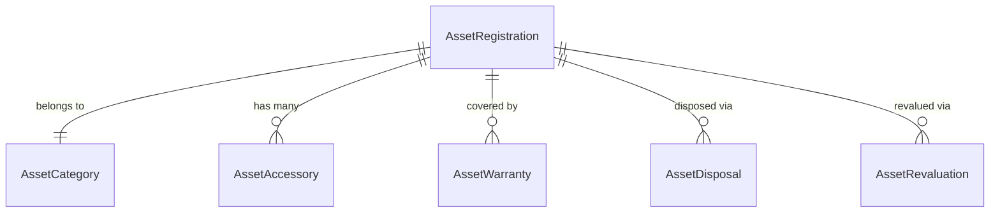
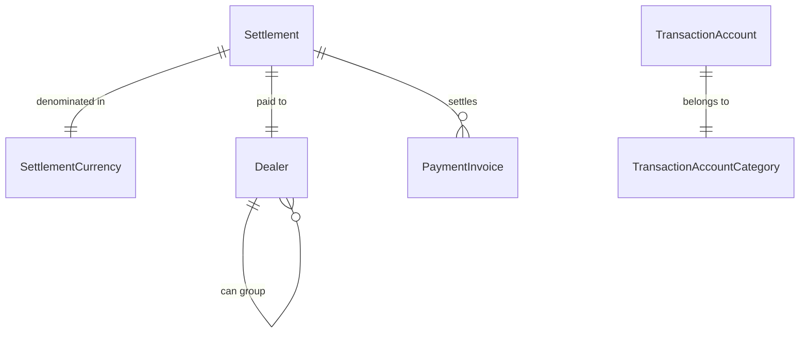
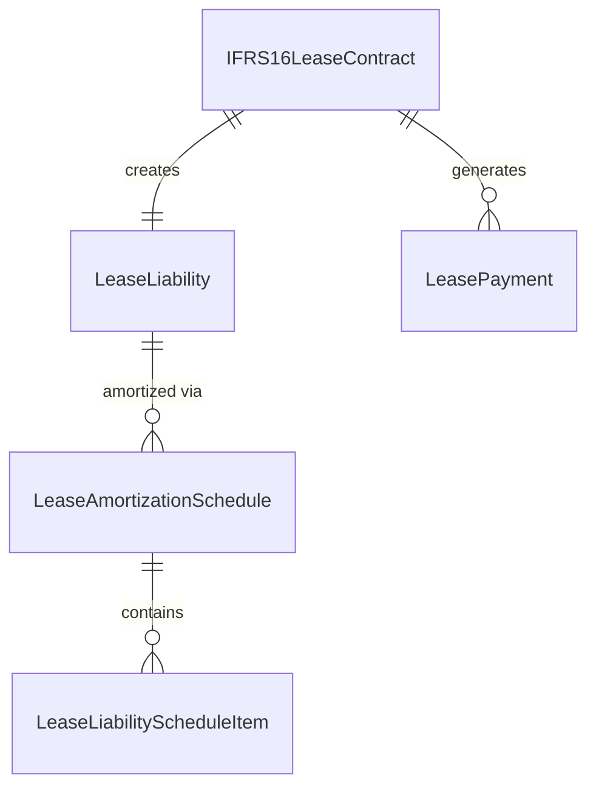
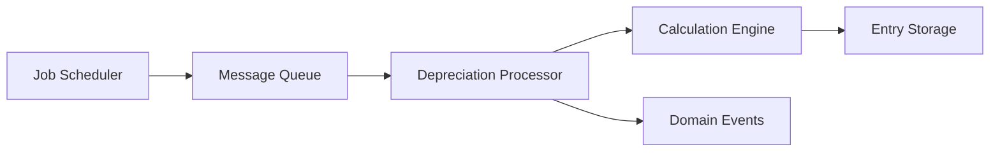
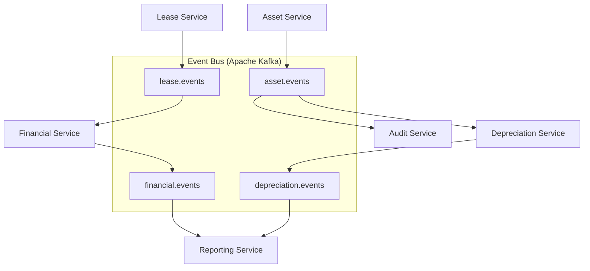
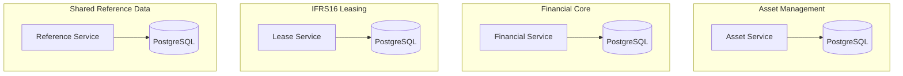
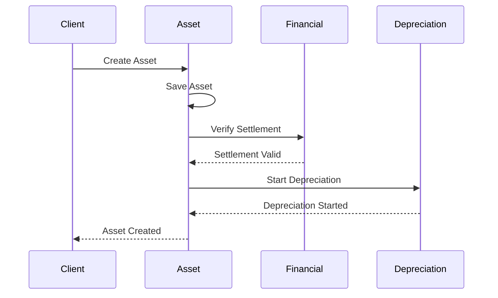

# ERP System Microservices Architecture Design

## Executive Summary

This document proposes a microservices architecture for the ERP System based on the analysis of **300+ domain entities** across **6 major business domains**. The design follows Domain-Driven Design (DDD) principles to establish clear bounded contexts, reduce coupling, and improve scalability and maintainability.

## Current State Analysis

The existing monolithic architecture contains tightly coupled entities across multiple business domains, leading to:
- Complex inter-domain relationships
- Performance bottlenecks from large entity graphs
- Difficult independent deployment and scaling
- Maintenance challenges due to cross-cutting concerns

## Proposed Microservices Architecture

### High-Level Service Architecture

```mermaid
graph TB
    subgraph "Client Layer"
        WEB[Web Application]
        MOBILE[Mobile App]
        API[External APIs]
    end
    
    subgraph "API Gateway Layer"
        GATEWAY[API Gateway]
        AUTH[Authentication Service]
    end
    
    subgraph "Core Business Services"
        ASSET[Asset Management Service]
        FINANCIAL[Financial Core Service]
        LEASE[IFRS16 Leasing Service]
        DEPRECIATION[Depreciation Service]
        WIP[Work-in-Progress Service]
        FISCAL[Fiscal Calendar Service]
    end
    
    subgraph "Supporting Services"
        DOCUMENT[Document Management Service]
        NOTIFICATION[Notification Service]
        REPORTING[Reporting Service]
        AUDIT[Audit Trail Service]
    end
    
    subgraph "Data Layer"
        ASSET_DB[(Asset DB)]
        FINANCIAL_DB[(Financial DB)]
        LEASE_DB[(Lease DB)]
        SHARED_DB[(Shared Reference DB)]
    end
    
    WEB --> GATEWAY
    MOBILE --> GATEWAY
    API --> GATEWAY
    
    GATEWAY --> AUTH
    GATEWAY --> ASSET
    GATEWAY --> FINANCIAL
    GATEWAY --> LEASE
    GATEWAY --> DEPRECIATION
    GATEWAY --> WIP
    GATEWAY --> FISCAL
    
    ASSET --> ASSET_DB
    FINANCIAL --> FINANCIAL_DB
    LEASE --> LEASE_DB
    DEPRECIATION --> ASSET_DB
    WIP --> ASSET_DB
    FISCAL --> SHARED_DB
    
    ASSET -.-> FINANCIAL : "Events"
    ASSET -.-> DEPRECIATION : "Events"
    WIP -.-> ASSET : "Events"
    LEASE -.-> FINANCIAL : "Events"
```

## Service Definitions

### 1. Asset Management Service

**Bounded Context**: Complete asset lifecycle management from acquisition to disposal.

#### Responsibilities:
- Asset registration and categorization
- Asset accessories and warranties management
- Asset disposal and revaluation
- Asset master data maintenance

#### Core Entities:
- `AssetRegistration` (Aggregate Root)
- `AssetCategory`
- `AssetAccessory`
- `AssetWarranty`
- `AssetDisposal`
- `AssetRevaluation`

#### API Endpoints:
```yaml
POST   /api/assets                    # Create asset
GET    /api/assets/{id}              # Get asset details
PUT    /api/assets/{id}              # Update asset
DELETE /api/assets/{id}              # Dispose asset
GET    /api/assets                   # List assets with filters
POST   /api/assets/{id}/accessories  # Add accessory
POST   /api/assets/{id}/warranties   # Add warranty
```

#### Database Schema:


### 2. Financial Core Service

**Bounded Context**: Financial transactions, settlements, and accounting operations.

#### Responsibilities:
- Payment processing and settlements
- Vendor/dealer management
- Invoice management
- Chart of accounts
- Multi-currency support

#### Core Entities:
- `Settlement` (Aggregate Root)
- `TransactionAccount` (Aggregate Root)
- `Dealer`
- `PaymentInvoice`
- `PurchaseOrder`
- `SettlementCurrency`

#### API Endpoints:
```yaml
POST   /api/settlements              # Create settlement
GET    /api/settlements/{id}         # Get settlement
PUT    /api/settlements/{id}         # Update settlement
GET    /api/settlements              # List settlements
POST   /api/dealers                  # Create dealer
GET    /api/dealers/{id}             # Get dealer
POST   /api/invoices                 # Create invoice
GET    /api/accounts                 # Chart of accounts
```

#### Database Schema:


### 3. IFRS16 Leasing Service

**Bounded Context**: Lease accounting compliance with IFRS16 standards.

#### Responsibilities:
- Lease contract management
- Lease liability calculations
- Lease payment processing
- Right-of-Use asset depreciation
- Amortization schedule generation

#### Core Entities:
- `IFRS16LeaseContract` (Aggregate Root)
- `LeaseLiability`
- `LeasePayment`
- `LeaseAmortizationSchedule`
- `RouDepreciationEntry`

#### API Endpoints:
```yaml
POST   /api/lease-contracts          # Create lease contract
GET    /api/lease-contracts/{id}     # Get contract details
POST   /api/lease-contracts/{id}/payments # Record payment
GET    /api/lease-liabilities        # List liabilities
GET    /api/amortization-schedules   # Get schedules
```

#### Database Schema:


### 4. Depreciation Service

**Bounded Context**: Automated depreciation calculations and batch processing.

#### Responsibilities:
- Depreciation calculation engine
- Batch job orchestration
- Depreciation period management
- Net book value tracking
- Multiple depreciation methods

#### Core Entities:
- `DepreciationJob` (Aggregate Root)
- `DepreciationEntry`
- `DepreciationPeriod`
- `DepreciationMethod`
- `NetBookValueEntry`

#### API Endpoints:
```yaml
POST   /api/depreciation/jobs        # Start depreciation job
GET    /api/depreciation/jobs/{id}   # Get job status
GET    /api/depreciation/entries     # List entries
POST   /api/depreciation/calculate   # Calculate depreciation
GET    /api/depreciation/periods     # List periods
```

#### Processing Architecture:


### 5. Work-in-Progress Service

**Bounded Context**: Project work and capital expenditure tracking.

#### Responsibilities:
- WIP registration and tracking
- Project management
- Cost accumulation
- Transfer to fixed assets
- Progress reporting

#### Core Entities:
- `WorkInProgressRegistration` (Aggregate Root)
- `WorkProjectRegister`
- `WorkInProgressTransfer`
- `WorkInProgressOverview`

#### API Endpoints:
```yaml
POST   /api/wip/registrations        # Create WIP item
GET    /api/wip/registrations/{id}   # Get WIP details
PUT    /api/wip/registrations/{id}   # Update WIP
POST   /api/wip/transfers            # Transfer to asset
GET    /api/wip/projects             # List projects
```

### 6. Fiscal Calendar Service

**Bounded Context**: Time-based organization for financial operations.

#### Responsibilities:
- Fiscal year management
- Period definitions
- Calendar synchronization
- Period status tracking

#### Core Entities:
- `FiscalYear` (Aggregate Root)
- `FiscalMonth`
- `FiscalQuarter`
- `DepreciationPeriod`

#### API Endpoints:
```yaml
GET    /api/fiscal/years             # List fiscal years
GET    /api/fiscal/months            # List months
GET    /api/fiscal/quarters          # List quarters
GET    /api/fiscal/current           # Current period info
POST   /api/fiscal/years             # Create fiscal year
```

## Supporting Services

### Document Management Service

**Purpose**: Centralized document and file management across all business services.

#### Responsibilities:
- File upload and storage
- Document metadata management
- File integrity verification
- Access control and permissions

#### API Endpoints:
```yaml
POST   /api/documents                # Upload document
GET    /api/documents/{id}           # Download document
DELETE /api/documents/{id}           # Delete document
GET    /api/documents                # List documents
```

### Reporting Service

**Purpose**: Cross-domain reporting and analytics.

#### Responsibilities:
- Report generation (PDF, Excel)
- Data aggregation across services
- Scheduled report delivery
- Dashboard data provision

#### API Endpoints:
```yaml
POST   /api/reports/generate         # Generate report
GET    /api/reports/{id}             # Get report
GET    /api/reports/templates        # List templates
GET    /api/dashboards/data          # Dashboard data
```

### Audit Trail Service

**Purpose**: Comprehensive audit logging across all services.

#### Responsibilities:
- Event logging and storage
- Audit trail queries
- Compliance reporting
- Change tracking

## Inter-Service Communication

### Communication Patterns

#### 1. Synchronous Communication (REST APIs)
- **Use Case**: Real-time queries and immediate consistency requirements
- **Pattern**: Direct HTTP calls through API Gateway
- **Example**: Asset Service → Financial Service for settlement verification

#### 2. Asynchronous Communication (Event-Driven)
- **Use Case**: Domain events and eventual consistency
- **Pattern**: Message queues (Apache Kafka)
- **Example**: Asset created → Depreciation service starts calculations

#### 3. Data Synchronization
- **Use Case**: Reference data sharing
- **Pattern**: Event sourcing and CQRS
- **Example**: Fiscal calendar updates propagated to all services

### Event-Driven Architecture



### Domain Events

#### Asset Domain Events:
- `AssetRegistered`
- `AssetCategoryChanged`
- `AssetDisposed`
- `AssetRevalued`

#### Financial Domain Events:
- `SettlementCreated`
- `PaymentProcessed`
- `InvoiceSettled`

#### Lease Domain Events:
- `LeaseContractCreated`
- `LeasePaymentMade`
- `LeaseLiabilityCalculated`

## Data Management Strategy

### Database per Service Pattern

Each microservice owns its data and database:



### Shared Reference Data

Common entities managed by dedicated service:
- `ServiceOutlet`
- `ApplicationUser`
- `Placeholder`
- `UniversallyUniqueMapping`

### Data Consistency Patterns

#### 1. Saga Pattern for Distributed Transactions


#### 2. Event Sourcing for Audit Trail
- All state changes captured as events
- Complete audit trail reconstruction
- Temporal queries and point-in-time recovery

## Technology Stack

### Core Technologies
- **Framework**: Spring Boot 3.x
- **Database**: PostgreSQL per service
- **Message Queue**: Apache Kafka
- **API Gateway**: Spring Cloud Gateway
- **Service Discovery**: Consul or Eureka
- **Configuration**: Spring Cloud Config

### Infrastructure
- **Containerization**: Docker
- **Orchestration**: Kubernetes
- **Monitoring**: Prometheus + Grafana
- **Logging**: ELK Stack (Elasticsearch, Logstash, Kibana)
- **Tracing**: Jaeger or Zipkin

### Security
- **Authentication**: OAuth 2.0 / JWT
- **Authorization**: Role-based access control
- **API Security**: Rate limiting, input validation
- **Data Encryption**: TLS in transit, AES at rest

## Deployment Architecture

### Kubernetes Deployment

```yaml
# Example deployment for Asset Service
apiVersion: apps/v1
kind: Deployment
metadata:
  name: asset-service
spec:
  replicas: 3
  selector:
    matchLabels:
      app: asset-service
  template:
    metadata:
      labels:
        app: asset-service
    spec:
      containers:
      - name: asset-service
        image: erp/asset-service:latest
        ports:
        - containerPort: 8080
        env:
        - name: DATABASE_URL
          valueFrom:
            secretKeyRef:
              name: asset-db-secret
              key: url
```

### Service Mesh (Optional)
- **Istio** for advanced traffic management
- **Linkerd** for simpler service mesh needs
- Benefits: Circuit breaking, retries, observability

## Migration Strategy

### Phase 1: Extract Supporting Services (Months 1-2)
1. Document Management Service
2. Audit Trail Service
3. Fiscal Calendar Service

### Phase 2: Extract Core Business Services (Months 3-6)
1. Asset Management Service
2. Financial Core Service
3. IFRS16 Leasing Service

### Phase 3: Extract Processing Services (Months 7-8)
1. Depreciation Service
2. Work-in-Progress Service
3. Reporting Service

### Phase 4: Optimize and Scale (Months 9-12)
1. Performance optimization
2. Advanced monitoring
3. Auto-scaling implementation

## Benefits and Trade-offs

### Benefits
- **Scalability**: Independent scaling of services
- **Maintainability**: Clear service boundaries
- **Technology Diversity**: Different tech stacks per service
- **Team Autonomy**: Independent development and deployment
- **Fault Isolation**: Service failures don't cascade

### Trade-offs
- **Complexity**: Distributed system challenges
- **Network Latency**: Inter-service communication overhead
- **Data Consistency**: Eventual consistency challenges
- **Operational Overhead**: More services to monitor and maintain
- **Testing Complexity**: Integration testing across services

## Monitoring and Observability

### Key Metrics
- **Business Metrics**: Asset count, settlement volume, depreciation accuracy
- **Technical Metrics**: Response time, error rate, throughput
- **Infrastructure Metrics**: CPU, memory, disk usage

### Alerting Strategy
- **Critical**: Service down, database connection failures
- **Warning**: High response times, error rate spikes
- **Info**: Deployment notifications, scaling events

## Conclusion

This microservices architecture provides a scalable, maintainable foundation for the ERP system while preserving business functionality. The design emphasizes clear domain boundaries, event-driven communication, and operational excellence through modern DevOps practices.

The migration should be executed incrementally to minimize risk and ensure business continuity throughout the transformation process.
