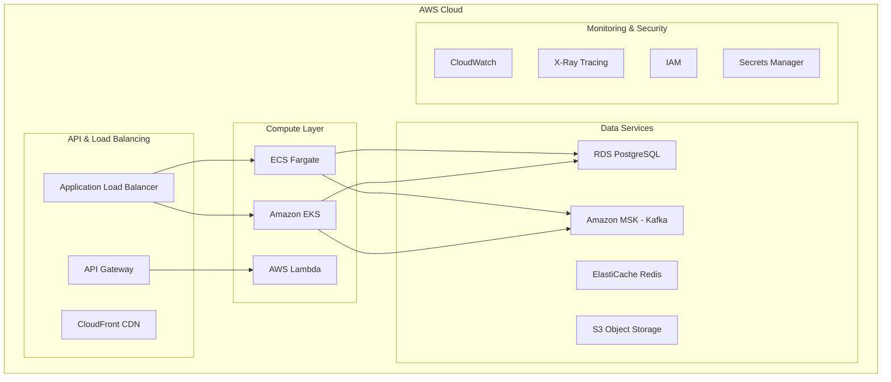
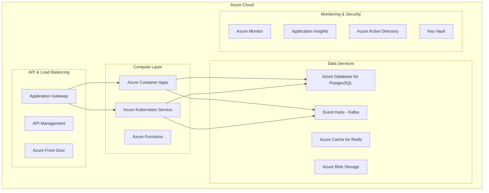
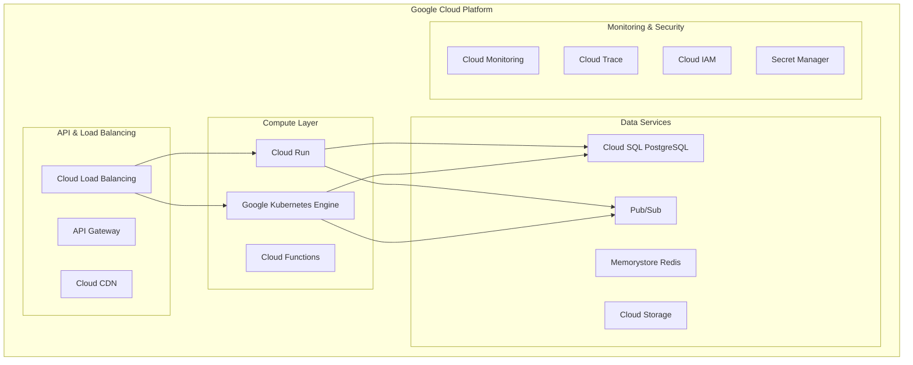

# Cloud-Native Deployment Evaluation for ERP System

## Executive Summary

This document evaluates cloud-native deployment options for the ERP System microservices architecture across AWS, Azure, and GCP. The analysis considers cost, complexity, vendor lock-in, and specific service capabilities to provide recommendations for each platform.

## Evaluation Criteria

### Technical Requirements
- **Container Orchestration**: Kubernetes or serverless containers
- **Database Services**: Managed PostgreSQL with high availability
- **Message Queuing**: Managed Kafka or equivalent streaming service
- **API Gateway**: Load balancing and routing capabilities
- **Monitoring & Observability**: Comprehensive logging, metrics, and tracing
- **Security**: Identity management, encryption, and compliance

### Business Requirements
- **Cost Optimization**: Predictable pricing with auto-scaling
- **Regional Availability**: Multi-region deployment capability
- **Compliance**: SOC 2, ISO 27001, GDPR compliance
- **Vendor Lock-in**: Minimize proprietary service dependencies
- **Migration Complexity**: Ease of migration from current infrastructure

## AWS Cloud Deployment

### Core Services Architecture



### Service Mapping

| ERP Service | AWS Service | Alternative |
|-------------|-------------|-------------|
| **Container Orchestration** | Amazon EKS | ECS Fargate |
| **Database** | RDS PostgreSQL Multi-AZ | Aurora PostgreSQL |
| **Message Queue** | Amazon MSK (Kafka) | Amazon SQS/SNS |
| **API Gateway** | AWS API Gateway | Application Load Balancer |
| **File Storage** | Amazon S3 | EFS for shared storage |
| **Caching** | ElastiCache Redis | ElastiCache Memcached |
| **Monitoring** | CloudWatch + X-Ray | Third-party (Datadog) |
| **Security** | IAM + Secrets Manager | AWS KMS |

### Deployment Architecture

#### Option 1: Amazon EKS (Recommended)
```yaml
# EKS Cluster Configuration
apiVersion: eksctl.io/v1alpha5
kind: ClusterConfig

metadata:
  name: erp-cluster
  region: us-west-2

nodeGroups:
  - name: erp-workers
    instanceType: m5.large
    desiredCapacity: 3
    minSize: 2
    maxSize: 10
    volumeSize: 100
    ssh:
      allow: true

addons:
  - name: aws-load-balancer-controller
  - name: cluster-autoscaler
  - name: aws-for-fluent-bit
```

#### Option 2: ECS Fargate (Serverless)
```yaml
# ECS Task Definition
family: asset-service
networkMode: awsvpc
requiresCompatibilities:
  - FARGATE
cpu: 512
memory: 1024
containerDefinitions:
  - name: asset-service
    image: erp/asset-service:latest
    portMappings:
      - containerPort: 8080
        protocol: tcp
    environment:
      - name: DATABASE_URL
        valueFrom: arn:aws:secretsmanager:region:account:secret:db-url
```

### Cost Analysis (Monthly Estimates)

| Component | Configuration | Monthly Cost (USD) |
|-----------|---------------|-------------------|
| **EKS Cluster** | 1 cluster | $73 |
| **EC2 Instances** | 3x m5.large (24/7) | $311 |
| **RDS PostgreSQL** | db.r5.large Multi-AZ | $365 |
| **Amazon MSK** | 3x kafka.m5.large | $450 |
| **Application Load Balancer** | 1 ALB | $23 |
| **ElastiCache** | cache.r5.large | $182 |
| **S3 Storage** | 1TB + requests | $25 |
| **CloudWatch** | Logs + metrics | $50 |
| **Data Transfer** | 500GB/month | $45 |
| **Total** | | **~$1,524/month** |

### Pros and Cons

#### Advantages
- **Mature Ecosystem**: Comprehensive service portfolio
- **EKS Integration**: Native Kubernetes with AWS services
- **Cost Optimization**: Spot instances, reserved capacity
- **Global Reach**: 25+ regions worldwide
- **Enterprise Support**: 24/7 support with TAM

#### Disadvantages
- **Complexity**: Steep learning curve for AWS services
- **Vendor Lock-in**: Heavy use of AWS-specific services
- **Cost Management**: Complex pricing models
- **MSK Limitations**: Kafka service less mature than competitors

### Migration Strategy
1. **Phase 1**: Set up VPC, RDS, and MSK
2. **Phase 2**: Deploy supporting services on EKS
3. **Phase 3**: Migrate core business services
4. **Phase 4**: Implement monitoring and optimization

## Azure Cloud Deployment

### Core Services Architecture



### Service Mapping

| ERP Service | Azure Service | Alternative |
|-------------|---------------|-------------|
| **Container Orchestration** | Azure Kubernetes Service | Azure Container Apps |
| **Database** | Azure Database for PostgreSQL | Azure SQL Database |
| **Message Queue** | Azure Event Hubs (Kafka) | Service Bus |
| **API Gateway** | Azure API Management | Application Gateway |
| **File Storage** | Azure Blob Storage | Azure Files |
| **Caching** | Azure Cache for Redis | In-memory caching |
| **Monitoring** | Azure Monitor + App Insights | Third-party solutions |
| **Security** | Azure AD + Key Vault | Managed Identity |

### Deployment Architecture

#### Option 1: Azure Kubernetes Service (Recommended)
```yaml
# AKS Cluster Configuration
apiVersion: v1
kind: ConfigMap
metadata:
  name: aks-cluster-config
data:
  cluster-name: erp-aks-cluster
  resource-group: erp-rg
  location: East US 2
  node-count: "3"
  node-vm-size: Standard_D4s_v3
  kubernetes-version: "1.28"
  enable-auto-scaling: "true"
  min-count: "2"
  max-count: "10"
```

#### Option 2: Azure Container Apps (Serverless)
```yaml
# Container App Configuration
apiVersion: app.containers.azure.com/v1beta1
kind: ContainerApp
metadata:
  name: asset-service
spec:
  environmentId: /subscriptions/.../environments/erp-env
  configuration:
    ingress:
      external: true
      targetPort: 8080
    secrets:
      - name: database-url
        value: postgresql://...
  template:
    containers:
      - name: asset-service
        image: erp/asset-service:latest
        resources:
          cpu: 0.5
          memory: 1Gi
    scale:
      minReplicas: 1
      maxReplicas: 10
```

### Cost Analysis (Monthly Estimates)

| Component | Configuration | Monthly Cost (USD) |
|-----------|---------------|-------------------|
| **AKS Cluster** | 1 cluster | $73 |
| **Virtual Machines** | 3x Standard_D4s_v3 | $387 |
| **Azure Database for PostgreSQL** | General Purpose, 4 vCores | $292 |
| **Event Hubs** | Standard tier, 20 TUs | $554 |
| **Application Gateway** | Standard_v2 | $36 |
| **Azure Cache for Redis** | Standard C3 | $251 |
| **Blob Storage** | 1TB + transactions | $21 |
| **Azure Monitor** | Logs + metrics | $45 |
| **Data Transfer** | 500GB/month | $43 |
| **Total** | | **~$1,702/month** |

### Pros and Cons

#### Advantages
- **Container Apps**: Serverless containers with auto-scaling
- **Integrated Security**: Azure AD integration
- **Hybrid Capabilities**: Strong on-premises integration
- **Enterprise Features**: Built-in compliance and governance
- **Event Hubs**: Kafka-compatible with better management

#### Disadvantages
- **Higher Costs**: Generally more expensive than AWS
- **Service Maturity**: Some services less mature than AWS
- **Regional Availability**: Fewer regions than AWS/GCP
- **Learning Curve**: Different paradigms from AWS

### Migration Strategy
1. **Phase 1**: Set up resource groups, networking, and databases
2. **Phase 2**: Deploy Container Apps for supporting services
3. **Phase 3**: Migrate to AKS for core services
4. **Phase 4**: Implement Azure Monitor and optimization

## Google Cloud Platform (GCP) Deployment

### Core Services Architecture



### Service Mapping

| ERP Service | GCP Service | Alternative |
|-------------|-------------|-------------|
| **Container Orchestration** | Google Kubernetes Engine | Cloud Run |
| **Database** | Cloud SQL PostgreSQL | AlloyDB for PostgreSQL |
| **Message Queue** | Pub/Sub | Cloud Tasks |
| **API Gateway** | API Gateway | Cloud Load Balancing |
| **File Storage** | Cloud Storage | Filestore |
| **Caching** | Memorystore Redis | In-memory caching |
| **Monitoring** | Cloud Monitoring + Trace | Third-party solutions |
| **Security** | Cloud IAM + Secret Manager | Workload Identity |

### Deployment Architecture

#### Option 1: Google Kubernetes Engine (Recommended)
```yaml
# GKE Cluster Configuration
apiVersion: container.cnrm.cloud.google.com/v1beta1
kind: ContainerCluster
metadata:
  name: erp-gke-cluster
spec:
  location: us-central1
  initialNodeCount: 3
  nodeConfig:
    machineType: e2-standard-4
    diskSizeGb: 100
    oauthScopes:
      - https://www.googleapis.com/auth/cloud-platform
  addonsConfig:
    horizontalPodAutoscaling:
      disabled: false
    httpLoadBalancing:
      disabled: false
```

#### Option 2: Cloud Run (Serverless)
```yaml
# Cloud Run Service Configuration
apiVersion: serving.knative.dev/v1
kind: Service
metadata:
  name: asset-service
  annotations:
    run.googleapis.com/ingress: all
spec:
  template:
    metadata:
      annotations:
        autoscaling.knative.dev/maxScale: "10"
        run.googleapis.com/cpu-throttling: "false"
    spec:
      containerConcurrency: 100
      containers:
        - image: gcr.io/project/asset-service:latest
          ports:
            - containerPort: 8080
          resources:
            limits:
              cpu: 1000m
              memory: 2Gi
          env:
            - name: DATABASE_URL
              valueFrom:
                secretKeyRef:
                  name: db-secret
                  key: url
```

### Cost Analysis (Monthly Estimates)

| Component | Configuration | Monthly Cost (USD) |
|-----------|---------------|-------------------|
| **GKE Cluster** | 1 cluster | $73 |
| **Compute Engine** | 3x e2-standard-4 | $195 |
| **Cloud SQL PostgreSQL** | db-standard-4, HA | $320 |
| **Pub/Sub** | 1M messages/day | $40 |
| **Cloud Load Balancing** | Global LB | $18 |
| **Memorystore Redis** | Standard M3 | $178 |
| **Cloud Storage** | 1TB + operations | $20 |
| **Cloud Monitoring** | Logs + metrics | $35 |
| **Network Egress** | 500GB/month | $45 |
| **Total** | | **~$924/month** |

### Pros and Cons

#### Advantages
- **Cost Effective**: Generally lowest cost among major clouds
- **Cloud Run**: Excellent serverless container platform
- **Networking**: Superior global network infrastructure
- **AI/ML Integration**: Best-in-class machine learning services
- **Simplicity**: Cleaner, more intuitive service design

#### Disadvantages
- **Service Portfolio**: Smaller service ecosystem than AWS/Azure
- **Enterprise Features**: Fewer enterprise-specific services
- **Market Share**: Smaller ecosystem and community
- **Kafka Alternative**: Pub/Sub different from Kafka paradigm

### Migration Strategy
1. **Phase 1**: Set up VPC, Cloud SQL, and Pub/Sub
2. **Phase 2**: Deploy Cloud Run services for supporting services
3. **Phase 3**: Migrate to GKE for core services
4. **Phase 4**: Implement monitoring and cost optimization

## Comparative Analysis

### Cost Comparison Summary

| Platform | Monthly Cost | Annual Cost | 3-Year TCO |
|----------|-------------|-------------|------------|
| **AWS** | $1,524 | $18,288 | $54,864 |
| **Azure** | $1,702 | $20,424 | $61,272 |
| **GCP** | $924 | $11,088 | $33,264 |

*Note: Costs are estimates and may vary based on actual usage patterns, reserved instances, and enterprise discounts.*

### Feature Comparison Matrix

| Feature | AWS | Azure | GCP |
|---------|-----|-------|-----|
| **Kubernetes Service** | ⭐⭐⭐⭐⭐ | ⭐⭐⭐⭐ | ⭐⭐⭐⭐⭐ |
| **Serverless Containers** | ⭐⭐⭐⭐ | ⭐⭐⭐⭐⭐ | ⭐⭐⭐⭐⭐ |
| **Managed PostgreSQL** | ⭐⭐⭐⭐⭐ | ⭐⭐⭐⭐ | ⭐⭐⭐⭐ |
| **Message Streaming** | ⭐⭐⭐ | ⭐⭐⭐⭐ | ⭐⭐⭐ |
| **Global Network** | ⭐⭐⭐⭐ | ⭐⭐⭐ | ⭐⭐⭐⭐⭐ |
| **Enterprise Security** | ⭐⭐⭐⭐⭐ | ⭐⭐⭐⭐⭐ | ⭐⭐⭐⭐ |
| **Cost Optimization** | ⭐⭐⭐⭐ | ⭐⭐⭐ | ⭐⭐⭐⭐⭐ |
| **Service Ecosystem** | ⭐⭐⭐⭐⭐ | ⭐⭐⭐⭐ | ⭐⭐⭐ |

### Vendor Lock-in Assessment

| Platform | Lock-in Level | Mitigation Strategies |
|----------|---------------|----------------------|
| **AWS** | High | Use open-source alternatives (self-managed Kafka, PostgreSQL) |
| **Azure** | Medium | Leverage hybrid capabilities, use standard APIs |
| **GCP** | Low | Most services have open-source equivalents |

## Recommendations

### Primary Recommendation: Google Cloud Platform (GCP)

**Rationale:**
- **Cost Efficiency**: 40-45% lower costs than AWS/Azure
- **Cloud Run Excellence**: Best serverless container platform
- **Kubernetes Leadership**: GKE is industry-leading Kubernetes service
- **Network Performance**: Superior global network infrastructure
- **Simplicity**: Cleaner service design reduces operational complexity

**Recommended Architecture:**
- **Compute**: GKE for core services, Cloud Run for supporting services
- **Database**: Cloud SQL PostgreSQL with high availability
- **Messaging**: Pub/Sub (with Kafka compatibility layer if needed)
- **Storage**: Cloud Storage for documents and files
- **Monitoring**: Cloud Monitoring with Cloud Trace

### Secondary Recommendation: Amazon Web Services (AWS)

**Rationale:**
- **Mature Ecosystem**: Most comprehensive service portfolio
- **Enterprise Adoption**: Largest market share and community
- **EKS Maturity**: Well-established Kubernetes service
- **Compliance**: Extensive compliance certifications

**Recommended Architecture:**
- **Compute**: Amazon EKS with Fargate for serverless workloads
- **Database**: RDS PostgreSQL Multi-AZ
- **Messaging**: Amazon MSK (managed Kafka)
- **Storage**: S3 for object storage
- **Monitoring**: CloudWatch with X-Ray tracing

### Alternative Consideration: Microsoft Azure

**Best For:**
- Organizations with existing Microsoft ecosystem
- Hybrid cloud requirements
- Strong compliance and governance needs

## Implementation Roadmap

### Phase 1: Foundation (Weeks 1-4)
- Set up cloud accounts and billing
- Configure networking (VPC/VNet)
- Deploy managed databases
- Set up CI/CD pipelines

### Phase 2: Supporting Services (Weeks 5-8)
- Deploy Document Management Service
- Deploy Audit Trail Service
- Deploy Fiscal Calendar Service
- Implement monitoring and logging

### Phase 3: Core Services (Weeks 9-16)
- Deploy Asset Management Service
- Deploy Financial Core Service
- Deploy IFRS16 Leasing Service
- Implement inter-service communication

### Phase 4: Processing Services (Weeks 17-20)
- Deploy Depreciation Service
- Deploy Work-in-Progress Service
- Deploy Reporting Service
- Performance optimization

### Phase 5: Production Readiness (Weeks 21-24)
- Security hardening
- Disaster recovery setup
- Performance testing
- Go-live preparation

## Risk Mitigation

### Technical Risks
- **Data Migration**: Implement comprehensive backup and rollback procedures
- **Service Dependencies**: Use circuit breakers and fallback mechanisms
- **Performance**: Conduct thorough load testing before migration

### Business Risks
- **Downtime**: Implement blue-green deployment strategy
- **Cost Overruns**: Set up billing alerts and cost monitoring
- **Vendor Lock-in**: Use containerization and standard APIs

### Operational Risks
- **Skills Gap**: Provide cloud training for development and operations teams
- **Security**: Implement security best practices and regular audits
- **Compliance**: Ensure cloud services meet regulatory requirements

## Conclusion

The cloud deployment evaluation recommends **Google Cloud Platform** as the primary choice for the ERP System modernization, offering the best balance of cost efficiency, technical capabilities, and operational simplicity. The serverless-first approach with Cloud Run and GKE provides excellent scalability while minimizing operational overhead.

For organizations requiring the most comprehensive service ecosystem or having existing AWS investments, **Amazon Web Services** remains a strong alternative with proven enterprise capabilities.

The migration should follow a phased approach, starting with supporting services and gradually moving core business functionality to minimize risk and ensure business continuity throughout the transformation process.
